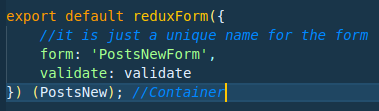

# React JS Notes

- [React JS Notes](#react-js-notes)
    - [Basic Introduction](#basic-introduction)
    - [Importing Stuffs](#importing-stuffs)
    - [Comments](#comments)
    - [this Binding](#this-binding)
        - [**First Way**](#first-way)
        - [**Second Way**](#second-way)
        - [**Third Way**](#third-way)
        - [**Fourth Way - Property Initializers**](#fourth-way---property-initializers)
    - [Object Destructing](#object-destructing)
    - [Refs](#refs)
        - [**First way - Using String**](#first-way---using-string)
        - [**Second way - Using Callback Function**](#second-way---using-callback-function)
    - [Package.json Configuration](#packagejson-configuration)
    - [Redux](#redux)
        - [ReduxForm](#reduxform)

##  Basic Introduction

**Component:** Component is a Javascript function that returns HTML. We can also call the Components as View as they render elements in the display. 

**JSX:**
- JSX cannot be interpreted by the browser. 
- The purpose of JSX is that it gets inserted inside the DOM when we render the component containing JSX. JSX gets converted into HTML. 
- Basically, JSX is a Javascript code that produces HTML. JSX gets transpiled to vanilla JS using Babel. 
- JSX makes our much more cleaner, because writing the same code in plain JS would be a pain.
- wherever we use JSX we need to import the React package. 
- for multi-line JSX, we need to use () paranthesis after return keyword. 
 ---

**Rendering to the Dom:** 
- To render component to the DOM we need to pass the instance of the component to the ReactDOM.render(). Instance is <App />. 
Example:
```jsx 
ReactDOM.render(<App />, document.querySelector('.container'));
instead of: 
ReactDOM.render(App,document.querySelector('.container'));
```
---

**Class Components:**
- extending React.Component means providing our class with all the functionality that React.Component class has. 
- it must have a render method. 
- whenever we have a render function, we must **return** some JSX else it will throw an error.
- **constructor** is called everytime a new instance of the class is called. For example: `<App />` 
- constructor does a lot of things inside the class, one of the thing is initialize the state. 
- when we define a method that is already defined in the parent class, we can call that parent method on the parent class by calling **super**. 
-  
---
## Importing Stuffs
- **Import package and name it directly:**
    ```react
    import React, {Component} from 'react';
    ```
Here we are importing Component class from react package and assigning the variable named Component to it. 
It is same as writing: 
    ```react
    const Component = React.Component; 
    ```
- When we just want to render something on the display, we don't need the whole ReactDOM library, we can just import the render functionality from it. 
  ```jsx 
    import { render } from 'react-dom';

    render(< Component/>, TargeNode)
  ```
**State:**
- It is a plain javascript object used to record and react to user events. 
- Whenever a state is changed, the component re-renders along with its childrens. 
 ---
## Comments


comment inside JSX: `{/* Comment Goes Here! */}`
    - These comments are written usually inside the `return` statement, anywhere else we can use regular comments with `//`
    - Don't put the comment on the very first line of the return statement as it will throw an error. Use it after a sentence. 
    - Example: 
  
**Wrong Way**
```jsx
return(
    {/* This causes an error */}
    <p> This will not get rendered and cause an error </p>
);
```

**Right Way**
```jsx
return(
    <p>This will get rendered</p>
    {/* Comment here is fine */}
)
```
 ---

## this Binding 
 - `this` refers to the parent class in general. 
 - when we are writing `this` inside of the `render()` method, we are refering to the class in which it is called. 
 - when we have other helper function inside of the class, then the `this` mentioned inside the helper function is refering to the function itself. To make it refer to the parent class, we need to `bind` it to the parent class. 

**example:**

### **First Way**
```jsx
    class Person extends Component {
        constructor(props){
            super(props)
            this.state = {data: ''}
            /*Step 3: Bind the sendData `this` to the parent class. */
            this.sendData = this.sendData.bind(this);
        }
        sendData(){
            /*Step 2: Here `this` refers to the function sendData, to make it refer to the parent class we have to bind the function with the parent class */
            console.log(this.state.data)
        }
        render() {
            return (
                <form onSubmit = {this.sendData}>
                {/* Step 1: Here this, refers to the class Person, it takes sendData method of class function, it's like Person.sendData */}
                    <input value = {this.state.data} onChange={e => this.setState({data: e.target.value})} />
                    <button type="submit">Send Data</button>
                </form>
            );
        }
    }
```
### **Second Way**
```jsx
    class Person extends Component {
        sendData(){
            /*Step 2: Now the `this` mentioned here refers to the parent class Person. */
            console.log(this.state.data)
        }
        render() {
            return (
                <form onSubmit = {this.sendData.bind(this)}>
                {/* Step 1: Here the first `this` refers to the class Person, it takes sendData method of class function, it's like Person.sendData,
                then it binds the `this` of sendData() method to the parent class. */}
                    <input value = {this.state.data} onChange={e => this.setState({data: e.target.value})} />
                    <button type="submit">Send Data</button>
                </form>
            );
        }
    }
```

### **Third Way**
```jsx
    class Person extends Component {
        sendData(){
            /*Step 2: Now the `this` mentioned here refers to the parent class Person. */
            console.log(this.state.data)
        }
        render() {
            return (
                <form onSubmit = {e=> this.sendData(e)}>
                {/* Step 1: This method is inefficient because, it create a new function everytime it something has to refer to this helper*/}
                    <input value = {this.state.data} onChange={e => this.setState({data: e.target.value})} />
                    <button type="submit">Send Data</button>
                </form>
            );
        }
    }
```
### **Fourth Way - Property Initializers**
```jsx
    class Person extends Component {

        /* This is much more efficient. Here arrow function by default moves the `this` binding to the main class.
            It is important to add semicolon (;) at the end of the block */
        sendData = () => {
            console.log(this.state.data)
        }; /*Semicolon at the end of the block*/
        render() {
            return (
                <form onSubmit = {e=> this.sendData(e)}>
                    <input value = {this.state.data} onChange={e => this.setState({data: e.target.value})} />
                    <button type="submit">Send Data</button>
                </form>
            );
        }
    }
```

 ---
## Object Destructing
 - Whenever we are passing a props, it is tedious to write the whole `this.props.props.propsattr` and so on. If we have to use the props in more than one place, then it is much more difficult. To overcome this issue and other issues where we define a variable to make these statements short, we can use `Object Destructing.`

**Example: 1**
```jsx 
    {/* Normal Way */}
    var details = this.props.details; 

    {/* ES6 Object Destructing */}
    var { details } = this.props;
```
- If we have passed multiple props, then we can name them in a single line. 

**Example: 2**
```jsx 
    {/* Normal Way */}
    var details = this.props.details; 
    var index = this.props.index;

    {/* ES6 Object Destructing */}
    var { details, index } = this.props;
```
---

## Refs
 Refs provide a way to access DOM nodes or React elements created in the render method.

**When to Use Refs**

There are a few good use cases for refs:

- Managing focus, text selection, or media playback.
- Triggering imperative animations.
- Integrating with third-party DOM libraries.
- Avoid using refs for anything that can be done declaratively.

> **Example:**

 Instead of using event to access value of the form we can use refs.

### **First way - Using String**
```jsx
        class Person extends Component {
        constructor(props){
            super(props)
            this.state = {data: ''}
            this.sendData = this.sendData.bind(this);
            this.getData = this.getData.bind(this);
        }
        sendData(){
            console.log(this.state.data)
        }
        getData(){
            this.setState({data: this.refs.evalue.value}) {/*Access the value of the DOM with the help of refs*/}
        }
        render() {
            return (
                <form onSubmit = {this.sendData}>
                    <input value = {this.state.data} onChange={this.getData} refs="evalue" /> {/*Expose the DOM using ref*/}
                    <button type="submit">Send Data</button>
                </form>
            );
        }
    }
```  

### **Second way -  Using Callback Function**
```jsx
        class Person extends Component {
        constructor(props){
            super(props)
            this.state = {data: ''}
            this.sendData = this.sendData.bind(this);
            this.getData = this.getData.bind(this);
        }
        sendData(){
            console.log(this.state.data)
        }
        getData(){
            this.setState({data: this.a.value}) {/*Access the value of the DOM with the help of refs, No need to mention refs*/}
        }
        render() {
            return (
                <form onSubmit = {this.sendData}>
                    <input value = {this.state.data} onChange={this.getData} refs={eval => this.a = eval} /> {/*Expose the DOM using ref*/}
                    <button type="submit">Send Data</button>
                </form>
            );
        }
    }
```  
 ---
## Package.json Configuration
**Difference between ~ and ^ in the file.**
- The tilde matches the most recent minor version (the middle number). ~1.2.3 will match all 1.2.x versions but will miss 1.3.0.
- The caret, on the other hand, is more relaxed. It will update you to the most recent major version (the first number). ^1.2.3 will match any 1.x.x release including 1.3.0, but will hold off on 2.0.0.

**Save something as an Dev Dependency**
- Dev Dependency means, the package is not needed in the production, and is requiered only for the development purpose. 
- To install packages as dev dependecies just use `--save-dev` flag when installing a new package to the project. 
    - **Example:**
    
        `npm install --save-dev path`
---
**Notes:** 
- Only one component per page, because React works better with isolation of functionality.
- put different components inside of /src/components folder for better organization. 
- don't forget to use `"--save"` flag whenever you are installing a new package to your project. 
- all of the JS files in react is silent to each other unless we explicitly define any connection between them.
- Only use class component whenever you want to save some data else functional component is fine. 
- small case in DOM name = HTML element, capital case in DOM name = JSX element.
Example: <div> is a HTML element. <App /> is a JSX element. 
- Instead of using `document.getElementById` use `document.querySelector(id or class)`
    select id using `#id_name`, select class using `.className`
- For emmet support in JSX use the following setting in VSCode: 
    ```json 
        "emmet.includeLanguages":{
            "javascript": "javascriptreact",
        }
    ```
---

## Redux
**Notes**
- Whenever we are thinking of saving data or making API request inside of a redux application, we have to do it through **ActionCreators**
- 

### ReduxForm
- Whenever we render the form, we have to export the form using reduxForm, where we give the form a uinque name. If we have some validation function, we mention it there as well with key value pair. Then on the second parenthesis, we pass the Container inside which our form is getting rendered.

    

- ReduxForm handles just the state and validation of our form.
- There are three states in ReduxForm: pristine, touched and invalid. 
    - prisitne: it has not been selected, it has no user input 
    - touched: user has focused and focused out of the input
    - invalid: show error message 
- ```react
    {field.meta.touched ? field.meta.error : ''}
    ```


